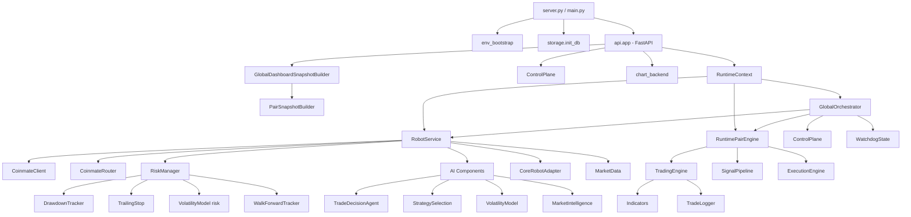

# 🔍 MyRobot — Analýza funkcí v4

> Kompletní katalog všech funkcí a tříd projektu. Aktualizováno: 2026-03-27.  
> Projekt: **krypto-obchodní robot** s Coinmate integrací, FastAPI dashboardem a AI enginem.

---

## 📊 Souhrn

| Metrika | Hodnota |
|---|---|
| Python souborů | 135+ |
| Definic funkcí/metod | 1 400+ |
| Tříd | ~90+ |
| Modulů | 17 hlavních balíčků |

---

## 1. Vstupní body

| Funkce | Soubor | Účel |
|---|---|---|
| `load_project_env()` | `main.py` | Načtení `.env` souboru |
| `init_db()` | `main.py` | Inicializace SQLite databáze |
| `app` (export) | `main.py` | FastAPI aplikace pro ASGI |
| `uvicorn.run(...)` | `server.py` | Dev server `127.0.0.1:8000` |

---

## 2. Konfigurace

### `config.py` — globální konstanty
| Konstanta | Default | Popis |
|---|---|---|
| `TIMEFRAME_DEFAULT` | `1d` | Výchozí časový rámec |
| `BASE_RISK` | `0.01` | Základní risk per trade |
| `MAX_POSITIONS` | `3` | Max souběžných pozic |
| `DB_PATH` | `trading_state.db` | Cesta k SQLite DB |
| `BT_START_EQUITY` | `10000` | Startovní kapitál backtestu |
| `API_HOST/PORT` | `127.0.0.1:8000` | Server binding |

### `strategy_config.py` — StrategyConfig
| Funkce / Třída | Účel |
|---|---|
| `MarketDataConfig` | Konfigurace zdroje dat (provider, timeframe, symboly) |
| `ExecutionConfig` | Konfigurace exekuční burzy (venue, páry) |
| `StrategyConfig` | Hlavní konfigurační objekt — risk, indikátory, fee, slippage |
| `.validate()` | Validace všech parametrů |
| `.from_dict()` | Deserializace z JSON/YAML dict |
| `._upgrade_legacy_dict()` | Migrace starého formátu na nový (market_data + execution split) |
| `load_strategy_config()` | Načtení a cache konfigurace ze souboru |

---

## 3. Env Bootstrap (`env_bootstrap.py`)

| Funkce | Účel |
|---|---|
| `_project_root()` | Vrátí kořen projektu |
| `load_project_env()` | Jednorazové načtení `.env` přes `python-dotenv` |

---

## 4. Storage Layer (`app/storage/`)

### `db.py` — SQLite wrapper (11 funkcí)
| Funkce | Účel |
|---|---|
| `get_conn()` | SQLite connection (WAL mode, thread-safe) |
| `init_db()` | Tabulky: `runs`, `decisions`, `backtests`, `portfolio_backtests`, `kv` |
| `kv_get/kv_set/kv_delete/kv_all` | Key-value CRUD operace |
| `_ensure_kv_table()` | Vytvoření KV tabulky if not exists |
| `_table_exists/_table_columns` | Introspekce schématu |
| `_add_column_if_missing()` | ALTER TABLE ADD COLUMN (migrace) |
| `_ensure_decisions_schema()` | Schema decisions + migrace risk→risk_pct |

### `logs.py` — JSONL + DB logging (5 funkcí)
| Funkce | Účel |
|---|---|
| `log_event(event, **fields)` | Zápis do `logs/trading.jsonl` |
| `record_run/record_decision` | Uložení běhu/rozhodnutí do DB |
| `fetch_latest_decisions(limit)` | Čtení posledních rozhodnutí z DB |
| `new_run_id()` | UUID run ID |

### `audit.py` — audit log (3 funkce)
| Funkce | Účel |
|---|---|
| `ensure_audit_table()` | Vytvoření `audit_log` tabulky |
| `log_event(event, data)` | Zápis audit záznamu |
| `recent(limit)` | Načtení posledních N záznamů |

---

## 5. Data Layer (`app/data/`)

### `MarketData` — OHLCV provider
| Metoda | Účel |
|---|---|
| `__init__(timeframe)` | Inicializace s výchozím timeframe |
| `set_timeframe(timeframe)` | Změna timeframe |
| `fetch_ohlcv_df(symbol, limit)` | Fetch OHLCV do pandas DataFrame |

---

## 6. Models (`app/models/`)

### `robot_state.py` — Pydantic modely (7 tříd)
| Třída | Účel |
|---|---|
| `RobotStatus` (Enum) | STOPPED, STARTING, RUNNING, PAUSED, MANUAL_CONTROL, ERROR |
| `TradeRecord` | Záznam obchodu (symbol, side, price, amount, pnl, fee) |
| `Position` | Otevřená pozice (size, entry_price, unrealized_pnl) |
| `AnalysisResult` | Výsledek analýzy (signal, confidence, indicators) |
| `PortfolioSnapshot` | Stav portfolia (balances, total_value, exposure) |
| `RiskMetrics` | Metriky rizika (risk_level, max_drawdown, exposure) |
| `RobotState` | Kompletní stav robota + metody: `update_timestamp`, `set_status`, `register_trade`, `merge_metadata` |

### `state_models.py` — Event systém (9 typů + 5 factory)
| Třída / Funkce | Účel |
|---|---|
| `EventType` (Enum) | HEARTBEAT, STEP, ANALYSIS, DECISION, RISK, TRADE, PORTFOLIO, ERROR, LOG |
| `RobotEventBase` | Bázový event (type, timestamp, severity, message, data) |
| `StepEvent, AnalysisEvent, DecisionEvent, ...` | Typované eventy |
| `*_event_from_payload()` × 5 | Factory funkce pro jednotlivé typy eventů |

---

## 7. Control Plane (`app/core/control_plane.py`) — 14 metod

| Metoda | Účel |
|---|---|
| `get(pair)` | Efektivní stav (global + pair overlay) |
| `set_pause/set_kill/set_emergency_stop` | Pozastavení / kill switch |
| `set_reduce_only/set_mode/set_armed` | Řízení režimu a armování |
| `set_readiness(...)` | Live readiness checklist |
| `can_trade/can_open_position/can_reduce_position` | Guard metody |
| `reset_safe_defaults/reset_runtime_guards` | Reset do bezpečného stavu |
| `sync_pair_runtime_to_global(...)` | Synchronizace páru s globálem |
| `as_dict(pair)` | Serializace stavu |

---

## 8. Guardrails (`app/core/guardrails.py`) — 8 funkcí

| Funkce | Účel |
|---|---|
| `load_guardrails() / set_guardrails()` | CRUD z KV store |
| `check_daily_loss(equity)` | Kontrola denní ztráty vs. limit |
| `register_execution_failure()` | Registrace selhání exekuce |
| `check_execution_failures()` | Kontrola limitu selhání |
| `get_consecutive_failures/clear_execution_failures` | Počítadlo selhání |

---

## 9. Validace (`app/core/validate.py`) — 8 funkcí + HealthReport

| Funkce | Účel |
|---|---|
| `validate_timeframe/validate_exec_pairs` | Validace formátů |
| `validate_market_symbols(provider, symbols)` | Validace symbolů per provider |
| `validate_risk(cfg)` | Kontrola risk parametrů |
| `validate_db()` | Smoke test DB |
| `validate_coinmate_keys()` | Kontrola Coinmate klíčů v env |
| `run_healthcheck(...)` | Souhrnný healthcheck → `HealthReport` |
| `as_api_payload(report)` | Konverze na API JSON |

---

## 10. Meta Strategy (`app/core/meta_strategy.py`) — 2 třídy

| Třída / Metoda | Účel |
|---|---|
| `StrategyPerformanceTracker` | Sledování výkonu (wins, pnl, avg_win/loss) |
| `.record_trade / .metrics` | Registrace obchodu / Winrate, R:R, Sharpe |
| `MetaStrategyEngine` | Výběr nejlepší strategie |
| `.weight / .best_strategy / .strategy_weights` | Výpočet vah (40% win, 30% RR, 30% sharpe) |

---

## 11. Runtime Context (`app/runtime/runtime_context.py`) — 20+ funkcí

### `RuntimeContext` — centrální runtime koordinátor
| Metoda | Účel |
|---|---|
| `initialize()` | Parse páry z env → build service map → orchestrátor |
| `get_pairs/get_robot_service/get_global_orchestrator` | Accessory |
| `get_pair_binding/get_pair_engine` | Runtime binding / engine pro pár |
| `get_or_create_pair_binding(pair)` | Lazy vytvoření bindingu + attach |
| `persist_pair_runtime_data(pair)` | Uložení runtime dat do KV |
| `update_pair_config(pair, **fields)` | Update config subsekce páru |
| `_resolve_control_plane()` | Singleton ControlPlane sdíleny s orchestrátorem |
| `_build_pair_engine(pair, service, orch)` | Konstrukce RuntimePairEngine |
| `_attach_service_to_global_orchestrator()` | Bezpečný attach service |

### Pomocné module-level funkce
| Funkce | Účel |
|---|---|
| `_parse_pairs_from_env()` | Parsování ROBOT_PAIRS (default 5 párů) |
| `_resolve_primary_pair(pairs)` | Výběr primárního páru (PRIMARY_PAIR env) |
| `_build_robot_service_for_pair(pair)` | Konstrukce RobotService + Coinmate stack |
| `_build_execution_stack(pair, creds)` | CoinmateClient + CoinmateRouter + RiskManager |
| `_validate_service(service, pair)` | Validace integrity |
| `_build_robot_service_map(pairs)` | Service map pro všechny páry |
| `get_runtime_context()` | Singleton RuntimeContext |
| `get_global_orchestrator/get_orchestrator` | Shortcut pro orchestrátor |

---

## 12. Trade Journal (`app/runtime/trade_journal.py`) — 6 metod

| Metoda | Účel |
|---|---|
| `log_trade/log_decision/log_risk` | Zápis do JSONL souborů |
| `recent_trades/recent_decisions/recent_risk` | Čtení posledních N záznamů |

### Watchdog (`watchdog_state.py`) — 1 funkce
| Funkce | Účel |
|---|---|
| `record_pair_health(pair, payload)` | Zápis health stavu páru do `pairs.json` |

---

## 13. Orchestrator (`app/orchestrator/global_orchestrator.py`) — 1 264 řádků, 40+ metod

### `GlobalOrchestrator` — async multi-pair lifecycle
| Metoda | Účel |
|---|---|
| `start() / stop()` | Async start/stop všech párů |
| `start_in_background()` | Daemon thread s vlastním event loop |
| `stop_background()` | Zastavení background threadu |
| `attach_service(pair, service)` | Připojení RobotService k páru |
| `get_service(pair)` | Získání service pro pár |
| `start_pair/stop_pair` | Lifecycle jednoho páru |
| `kill_pair_sync/resume_pair_sync` | Synchronní kill/resume z jiného threadu |
| `set_trading_mode(mode)` | Přepnutí paper/live pro všechny páry |
| `get_pair_state/get_all_states/snapshot` | Čtení stavů |
| `get_event_log()` | Seznam všech audit událostí |

### State management
| Metoda | Účel |
|---|---|
| `_ensure_state(pair)` | Lazy init RobotState + restore z persistence |
| `_update_state_incremental(pair, candidate)` | Inkrementální merge stavu (netracíme historii) |
| `_merge_trade_history(current, incoming)` | Deduplikace obchodů (max 2000 in-memory) |
| `_coerce_state_candidate(result)` | Normalizace různých typů na RobotState |
| `_sanitize_restored_state(pair, candidate)` | Korekce statusu obnovené state |
| `_persist_pair_runtime_state(pair)` | Uložení do RuntimeContext KV |
| `_restore_persistent_pair_runtime(pair)` | Obnovení z KV persistence |

### Pair cycle & health
| Metoda | Účel |
|---|---|
| `_run_pair_cycle(pair)` | Hlavní async smyčka (self-healing, backoff) |
| `_effective_pair_status(pair)` | Efektivní status (vs. kill switch, task stav) |
| `_validate_service_attachment(pair, service)` | Validace komponent per mode |
| `_component_requirements(service)` | Co je povinné pro paper vs. live |
| `_assert_service_pair_integrity(pair, service)` | Kontrola pair/router match |

---

## 14. Robot Service (`app/services/robot_service.py`) — 3 725 řádků, 80+ metod

### Inicializace & konfigurace
| Metoda | Účel |
|---|---|
| `__init__(pair, client, router, ...)` | Plná inicializace s autowire AI komponent |
| `bind_runtime_dependencies(...)` | Pozdní vazba client/router/risk/control_plane |
| `set_trading_mode(mode)` | Přepnutí paper/live |
| `_autowire_ai_components(pair)` | Auto-discovery 4 AI komponent z 20 kandidátních cest |
| `_resolve_component_from_candidates(...)` | Dynamický import + Smart instantiace |
| `_instantiate_component_safely(cls, pair)` | Signature analysis + fallback strategy |
| `_init_balances(starting_balance)` | Inicializace bilancí (base=0, quote=balance) |

### Market data
| Metoda | Účel |
|---|---|
| `_fetch_market_snapshot()` | Multi-source: client ticker → public API → chart backend → cache |
| `_fetch_reference_market_snapshot_from_chart()` | Fallback z chart_backend |
| `_normalize_ticker_payload(payload)` | Normalizace ticker dat (price, bid, ask, spread) |
| `_http_get_json(url)` | HTTP GET s User-Agent |
| `_market_tradeability(market_data)` | Kontrola obchodovatelnosti trhu (7 důvodů odmítnutí) |

### Order lifecycle (20+ metod)
| Metoda | Účel |
|---|---|
| `_normalize_order_status(status)` | Mapování 15+ variant statusu → `submitted/filled/canceled/...` |
| `_is_fill_status / _is_pending / _is_terminal` | Status guards |
| `_extract_order_id/status/filled_amount/remaining_amount` | Extrakce z heterogenních payloadů |
| `_register_pending_order(order)` | Registrace pending orderu |
| `_build_order_event(...)` | Konstrukce order lifecycle eventu |
| `_append_order_lifecycle(order, event)` | Zápis do order journalu |
| `_next_local_order_id(prefix)` | Generování lokálního ID |
| `_should_trade_journal(result)` | Kontrola zda logovat do trade journalu |

### Control & risk
| Metoda | Účel |
|---|---|
| `_control_state_payload()` | Aktuální stav ControlPlane pro pár |
| `_control_gate(side, intent, reduce_only)` | Per-order gate: mode, armed, kill, pause, reduce_only |
| `_risk_diagnostics_payload()` | Risk diagnostika pro telemetrii |
| `_note_risk_equity(mark_price)` | Notifikace risk manageru o equity |
| `_note_risk_execution_result(result)` | Notifikace o výsledku exekuce |
| `_build_execution_health()` | Health snapshot (client, account, router) |

### Model konverze
| Metoda | Účel |
|---|---|
| `_analysis_to_model(analysis)` | Dict → AnalysisResult |
| `_fallback_risk_metrics(portfolio)` | Výpočet risk metrik z portfolia |
| `_split_pair / _coinmate_currency_pair` | Parsování párů |

---

## 15. Telemetry (`app/services/telemetry.py`) — 3 funkce

| Metoda | Účel |
|---|---|
| `TelemetryService.emit(event, payload)` | Záznam telemetrické události do JSONL |
| `TelemetryService.recent(limit)` | Čtení posledních N událostí |
| `_jsonable(value)` | Bezpečná JSON serializace |

---

## 16. Snapshots (`app/core/snapshots/builders.py`) — 29 funkcí, 2 třídy

### `PairSnapshotBuilder` — snapshot jednoho páru
| Metoda | Účel |
|---|---|
| `build(pair)` | Kompletní snapshot páru (455 řádků logiky) |
| `_effective_status(pair, state)` | Efektivní status s ohledem na control plane |
| `_resolve_quote_balance(pair, balances)` | Nalezení quote balance (EUR/CZK/USD) |
| `_analysis_payload(service_snapshot)` | Extrakce analýzy z service snapshotu |
| `_has_valid_strategy/ai/risk_output(...)` | Validace výstupů pipeline |
| `_build_readiness(...)` | Readiness checklist pro pár |

### `GlobalDashboardSnapshotBuilder` — globální dashboard
| Metoda | Účel |
|---|---|
| `build()` | Kompletní dashboard (všechny páry + globální metriky) |
| `_build_global_readiness(pairs, control)` | Celková readiness robota |
| `_merge_balances(pairs)` | Agregace bilancí přes páry |
| `_build_holdings(pairs)` | Seznam držených aktiv |
| `_build_account_summary(pairs)` | Souhrnné equity, PnL, drawdown |
| `_build_portfolio_analytics(pairs)` | Portfolio analytika (diversifikace, korelace) |
| `_global_status(pairs)` | Globální status robota |

---

## 17. API Layer (`app/api/app.py`) — 2 400+ řádků

### Utility funkce (15)
`_safe_float`, `_safe_dict`, `_safe_list`, `_safe_str`, `_is_finite_number`, `_null_if_invalid_number`, `_sum_optional`, `_to_jsonable`, `_parse_timestamp`, `_epoch_seconds`, `_safe_confidence`, `_normalize_signal`, `_nested_get`, `_extract_plan_levels`, `_enum_name`

### Dashboard funkce (9)
| Funkce | Účel |
|---|---|
| `_market_summary()` | Globální tržní souhrn (BTC, ETH, ADA + sentiment) |
| `_dashboard_snapshot()` | Dashboard přes GlobalDashboardSnapshotBuilder |
| `_metrics_payload(dash)` | Extrakce equity, PnL, drawdown, risk_map |
| `_pair_snapshot/pair_public_payload` | Per-pair snapshoty |
| `_control_payload(pair)` | Stav řízení (mode, armed, kill_switch) |
| `_robot_status/_pairs` | Status robota / Seznam párů |
| `_sync_all_pairs_to_global_control()` | Sync párů s global control |

### Chart & Analýza (8)
`_swing_points`, `_true_range`, `_analyze_market_structure`, `_candles_price_tolerance`, `_history_time_bounds`, `_within_bounds`, `_pair_symbol_variants`, `_pair_matches_symbol`

### Pydantic request modely (5)
`ModeRequest`, `ArmRequest`, `CapitalRequest`, `ManualOrderRequest`, `KillSwitchRequest`

---

## 18. Core AI (`app/core/ai/`) — 50+ souborů

### Hlavní třídy (8)
| Třída | Účel |
|---|---|
| `TradeDecisionAgent` | Centrální rozhodovací agent (11 metod: decide, score, filter, reject) |
| `TradeScorer` | Scoring signálů (trend, volatilita, confidence) → 6 metod |
| `StrategySelection` | Fitness-based výběr z populace → 8 metod |
| `StrategyPopulation` | Správa populace strategií |
| `VolatilityModel` | Forecast volatility (ATR, returns stddev) → 8 metod |
| `VolatilityForecast` | Predikce volatility režimu → 3 metody |
| `WalkForwardValidator` | Walk-forward validace → 3 metody |
| `TrainingBuffer` | ML trénink buffer (features + labels) → 3 metody |

### Další AI moduly (40+)
`advanced_risk_manager`, `ai_engine`, `ai_market_data_aggregator`, `ai_performance_feedback_engine`, `ai_prediction_engine`, `ai_prediction_monitor`, `ai_risk_adaptation_engine`, `ai_trade_memory`, `auto_strategy_builder`, `bayesian_optimizer`, `crash_detector`, `deep_market_predictor`, `evolution_scheduler`, `feature_engineering`, `genetic_mutation`, `genome`, `global_market_context_engine`, `lstm_predictor`, `market_intelligence`, `market_prediction_system`, `market_predictor`, `market_regime_ai`, `market_sentiment`, `market_simulation_engine`, `market_structure`, `ml_pipeline`, `ml_signal_filter`, `model_manager`, `multi_timeframe_analysis`, `news_sentiment`, `onchain_analysis`, `orderflow_analysis`, `prediction_pipeline`, `quant_ai_agent`, `regime_detector`, `strategy_evolution_engine`, `strategy_fitness`, `strategy_generator`, `strategy_genome`

---

## 19. Core Engine (`app/core/engine/`) — 6 tříd

| Třída | Metod | Účel |
|---|---|---|
| `TradingEngine` | 12 | Hlavní engine: process(market_data) → trades |
| `SignalPipeline` | 5 | Pipeline: strategie → signály |
| `AISignalArbiter` | 9 | Scoring signálů (confidence, direction, volatility) |
| `TradeLogger` | 10 | JSONL logger s metrikami (winrate, PnL) |
| `TradeCooldown` | 7 | Cooldown mezi obchody (pair-scoped) |
| `RuntimePairEngine` | — | Per-pair runtime (service + orchestrator + control) |

---

## 20. Core Execution (`app/core/execution/`) — 6 tříd + 4 moduly

| Třída / Modul | Metod | Účel |
|---|---|---|
| `ExecutionEngine` | 8 | Abstrakce: send_order, cancel, status |
| `CoinmateRouter` | 7 | Routování na Coinmate (place/cancel/status) |
| `CoinmateClient` | — | HTTP klient pro Coinmate API |
| `OrderBookAnalyzer` | 3 | Analýza orderbooku (depth, spread) |
| `MarketIntelligenceSystem` | 12 | Agregace AI pro execution context |
| `position_sync` | 16 | Guardrails (daily loss, failures) pro execution |
| `b33_runtime_profile` | — | Runtime profily per pár |
| `b33_stale_data_guard` | — | Detekce zastaralých dat |
| `b33_order_reconciliation` | — | Rekonciliace orderů |
| `b33_supervisor` | — | Kill switch supervisor |

---

## 21. Core Market (`app/core/market/`) — 3 třídy + 20 funkcí

| Třída / Funkce | Účel |
|---|---|
| `Indicators` | EMA, RSI, ATR + summary |
| `OHLCVProvider` | OHLCV data (Binance/CoinGecko → DataFrame), 8 metod |
| `MarketRegimeDetector` | Detekce: trending/ranging/volatile |
| `fetch_chart(pair, tf, days)` | Chart data (daily/intraday) |
| `fetch_simple_prices()` | CoinGecko ceny BTC/ETH/ADA |
| `fetch_coinmate_ticker(pair)` | Live Coinmate ticker |
| `load_market_snapshot/load_multi_snapshot` | Multi-pair market snapshot |
| `_build_overlay/_ema_series/_aggregate_market_chart` | Chart transformace |

---

## 22. Core Risk (`app/core/risk/`) — 5 tříd

| Třída | Metod | Účel |
|---|---|---|
| `RiskManager` | 15 | note_equity, evaluate, position sizing, halt logic |
| `RiskConfig` | — | Konfigurace (max_dd, daily_loss, halt_on_dd) |
| `_DrawdownTracker` | 8 | Drawdown + auto-halt politika |
| `TrailingStop` | 6 | Trailing SL (% nebo ATR-based) |
| `VolatilityModel` | 9 | Volatilita z closes (std, EWMA), persist/restore |
| `WalkForwardTracker` | 8 | Walk-forward tracking, windowed metrics |

---

## 23. Core Trading (`app/core/trading/engine.py`)

### `TradingEngine` — 5 metod
| Metoda | Účel |
|---|---|
| `generate_signals(df)` | BUY/SELL signály z DataFrame |
| `run_once(market_data)` | Jeden cyklus: fetch → signals → decisions |
| `_corr_multiplier(...)` | Korelační multiplikátor pro diverzifikaci |
| `_get_held_symbols()` | Aktuálně držené symboly |
| `_build_decision_from_analysis(...)` | Konverze analýzy na rozhodnutí |

---

## 24. Infra (`app/infra/`) — 4 moduly, 17 funkcí

### `mode_lock.py` — thread-safe mode management (12 funkcí)
| Funkce | Účel |
|---|---|
| `current_timeframe/read_mode/read_live_armed` | Čtení stavových klíčů z KV |
| `is_live_armed/config_locked` | Booleovské guards |
| `set_config_locked(locked)` | Nastavení config locku |
| `sync_mode_keys(...)` | Synchronizace mode/armed/timeframe do KV |
| `apply_timeframe(timeframe)` | Aplikace nového timeframe |
| `timeframe_to_minutes(tf)` | Konverze timeframe na minuty |
| `get_runtime_mode/set_runtime_mode` | Runtime mode snapshot/update |

### `emergency_arm.py` — emergency arm/disarm (4 funkce)
| Funkce | Účel |
|---|---|
| `arm_emergency(ttl_sec, reason)` | Armování s TTL tokenem |
| `is_emergency_armed(token)` | Validace tokenu + TTL |
| `emergency_status()` | Aktuální stav emergency armu |
| `clear_emergency_arm()` | Zrušení emergency armu |

### `json_sanitize.py` / `trading_step_lock.py`
| Funkce | Účel |
|---|---|
| `json_sanitize(obj)` | Rekurzivní NaN/Inf → null |
| `trading_step_lock(timeout)` | Context manager s file-based lockem |

---

## 25. Scripts (`scripts/`) — 5 utilit

| Soubor | Účel |
|---|---|
| `check_runtime.py` | Kontrola runtime závislostí |
| `health_snapshot.py` | Health snapshot pro monitoring |
| `paper_run.py` | Paper trading runner (--offline --steps N) |
| `telemetry_smoke.py` | Smoke test telemetrie |
| `watchdog_fail_safe.py` | Watchdog fail-safe mechanismus |

---

## Diagram závislostí

---

> **Pozn.:** Toto je analytický dokument v4. Žádné změny v kódu nebyly provedeny.
