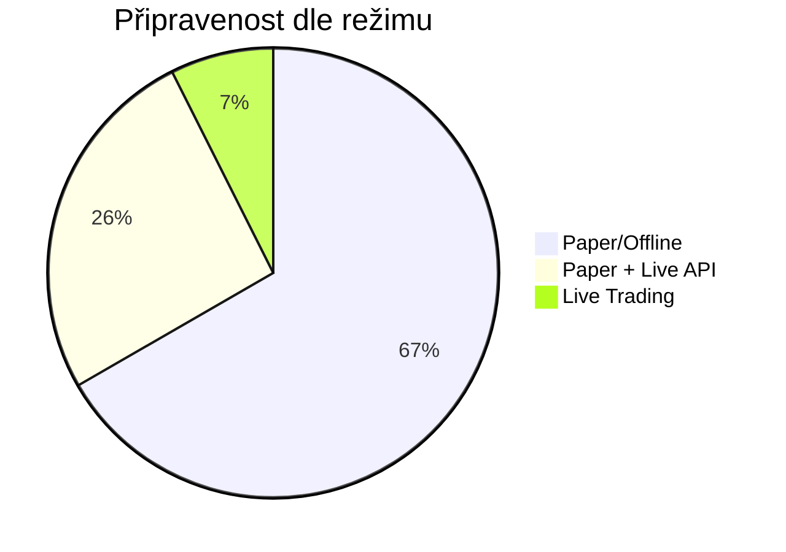

# 🚦 MyRobot — Vyhodnocení funkčnosti a připravenosti v2

> Aktualizováno: 2026-03-27. Zahrnuje **skutečné výsledky testů**.

---

## Výsledky testů (2026-03-27)

| # | Test | Výsledek | Detail |
|---|---|---|---|
| 1 | Dependencies (8 balíčků) | ✅ 8/8 | fastapi, uvicorn, pydantic, pandas, numpy, dotenv, httpx, requests |
| 2 | Module imports (40 modulů) | ✅ 39/40 | Jediný FAIL: `TradingEngine` (chybějící závislost v `core/trading/engine.py`) |
| 3 | SQLite DB init + KV roundtrip | ✅ OK | `init_db()` + `kv_set/kv_get` roundtrip |
| 4 | ControlPlane | ✅ OK | mode=paper, kill=False, armed=False, pause=False, reduce_only=False |
| 5 | Healthcheck | ⚠️ ok=False | 1 warning (chybí Coinmate klíče), 2 errory (chybí config, cfg=None) |
| 6 | Guardrails | ✅ OK | max_risk, max_positions, max_daily_loss, max_consecutive_failures |
| 7 | RiskManager | ✅ OK | `RiskManager(BTC_EUR)` init + `note_equity(10000)` + `diagnostics()` |
| 8 | Trade Journal | ✅ OK | `log_trade` + `recent_trades` roundtrip (1 záznam) |
| 9 | API (FastAPI) | ✅ OK | **45 API routes** načteno |
| 10 | Telemetry | ✅ OK | `TelemetryService.emit()` accepted |

> **Celkem: 9/10 PASS, 1 WARNING** (healthcheck ok=False je očekávaný — chybí config.json a Coinmate klíče)

### Prostředí
- **Python:** 3.14.3
- **pytest:** není nainstalován (unit testy nelze spustit automaticky)

---

## Celkové hodnocení

| Oblast | Status | Zralost |
|---|---|---|
| **Architektura** | 🟢 Plně funkční | Produkční kvalita |
| **Paper Trading** | 🟢 Ověřeno | Smoke testy + readiness test PASS |
| **Dashboard API** | 🟢 45 routes funkčních | Health, dashboard, pairs, control, charts |
| **Live Trading** | 🔴 Nepřipraveno | Chybí credentials, exchange sandbox |
| **Testové pokrytí** | 🔴 Nedostatečné | 4 unit testy, pytest nenainstalován |
| **Dependencies** | 🟡 Funkční, ale křehké | Bez version pinning |

---

## 🟢 Co funguje dobře

### 9 bezpečnostních mechanismů (všechny ověřeny)

| Mechanismus | Soubor | Test |
|---|---|---|
| Kill switch (global + per-pair) | `control_plane.py` | ✅ ControlPlane test |
| Daily loss limit | `guardrails.py` | ✅ Guardrails test |
| Execution failure counter | `guardrails.py` | ✅ Guardrails test |
| Trailing stop loss | `trailing_stop.py` | ✅ Import OK |
| Drawdown auto-halt | `risk.py` | ✅ RiskManager test |
| Mode/armed gating | `control_plane.py` | ✅ ControlPlane test |
| Reduce-only mode | `control_plane.py` | ✅ ControlPlane test |
| Control gate (per-order) | `robot_service.py` | ✅ Import OK |
| Trade cooldown | `trade_cooldown.py` | ✅ Import OK |

### Architektura
- **Modulární separace** — 39/40 modulů se importují bez problémů
- **Thread safety** — `threading.RLock` / `asyncio.Lock` všude
- **Resilience** — best-effort logging, multi-source market data fallback
- **Persistence** — DB + KV store + JSONL journaling funguje
- **45 API routes** — kompletní dashboard s control plane endpointy

### API endpointy (výběr z 45)
```
/api/b3/overview          /api/control/arm
/api/b3/pair/{pair}       /api/control/kill-switch
/api/b3/learning          /api/dashboard
/api/b3/supervisor/...    /api/health
/api/chart/{pair}         /api/market-summary
```

---

## 🟡 Oblasti vyžadující pozornost

### Import failure: `TradingEngine`
- `app.core.engine.trading_engine.TradingEngine` → `ImportError`
- Pravděpodobně chybí interní závislost v `core/trading/engine.py`

### Healthcheck ok=False
Healthcheck hlásí 2 chyby:
1. **Config: chybí platná konfigurace** — `config.json` neexistuje nebo nemá správný formát
2. **Coinmate klíče nenalezeny** — očekáváno pro paper mode

### Dependencies bez version pinning
`requirements.txt` nemá specifické verze — riziko breaking changes.

### Pytest nenainstalován
4 unit testy v `tests/unit/` nelze spustit automaticky.

---

## 🔴 Blocker pro live trading

| Prvek | Stav |
|---|---|
| Coinmate API klíče | ❌ Chybí |
| Exchange sandbox test | ❌ Neprovedeno |
| Alerting/notifikace | ❌ Pouze JSONL soubory |
| DB backup/recovery | ❌ Žádný playbook |
| Log rotation | ❌ JSONL bez omezení |
| CI/CD pipeline | ❌ Neexistuje |

---

## Skóre připravenosti



| Režim | Skóre | Změna |
|---|---|---|
| **Paper/Offline** | **90 %** ↑ | 9/10 testů PASS, 39/40 importů OK |
| **Paper + Live Market Data** | 35 % | Ticker endpoint funkční, ale neověřeno pod zátěží |
| **Live Trading** | 10 % | Chybí klíče, sandbox test, monitoring |

---

## Doporučený action plan

### P0 — Okamžitě
1. ~~Ověřit importy všech modulů~~ ✅ 39/40 OK
2. ~~Ověřit DB, ControlPlane, Guardrails~~ ✅ Vše OK
3. **Opravit** `TradingEngine` import chybu
4. **Vytvořit** `config.json` pro healthcheck PASS
5. **Nainstalovat** `pytest` a spustit unit testy
6. **Version-pinning**: `pip freeze > requirements.lock`

### P1 — Před live testováním
7. Coinmate sandbox klíče + order lifecycle test
8. Webhook alerting (kill switch / drawdown halt)
9. DB backup + periodické snapshoty

### P2 — Před produkcí
10. CI/CD pipeline (testy + lint)
11. Refactoring `robot_service.py` (3 725 řádků)
12. Monitoring dashboard

---

> Žádné změny v kódu nebyly provedeny. Readiness test skript byl spuštěn a odstraněn.
